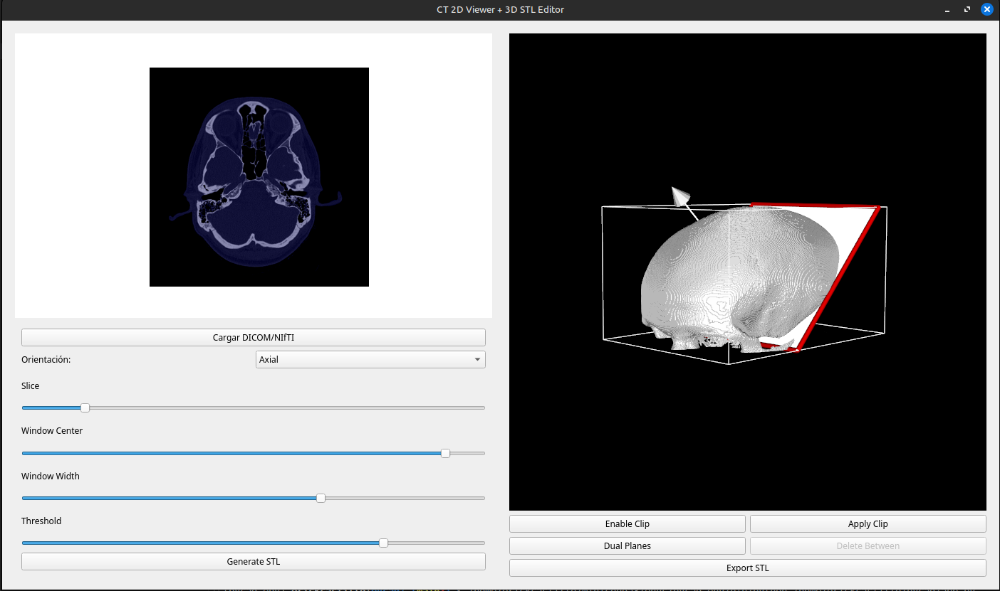

# CT 2D Viewer + 3D STL Editor

**Visualiza, explora y edita estudios de tomografía (CT) en 2D y 3D, genera mallas STL y realiza cortes interactivos sobre el modelo. Proyecto 100% en Python.**

---

## Descripción

Esta aplicación de escritorio permite cargar estudios médicos (CT) en formato **DICOM** o **NIfTI**, visualizar slices 2D con controles avanzados (orientación, ventana/centro, umbral), generar modelos 3D en formato STL mediante marching cubes, visualizar y editar el STL con herramientas de corte interactivo (single/dual plane clipping) y exportar el resultado. Todo el flujo es 100% Python y multiplataforma.

---

## Características

- **Visor 2D interactivo**: Navega en modo axial, coronal o sagital.
  - Ajusta brillo/contraste (window/level).
  - Umbral dinámico con overlay de segmentación.
  - Navegación por cortes (slice).
- **Generación y visualización 3D**:
  - Marching cubes automático con threshold seleccionable.
  - Vista 3D interactiva (rotación, zoom, paneo).
- **Edición 3D STL**:
  - Clipping interactivo: añade uno o dos planos y recorta el modelo.
  - El recorte puede aplicarse permanentemente.
  - Elimina regiones entre dos planos.
- **Exporta tu modelo**:
  - Guarda el STL generado/recortado.
- **Sin dependencias web ni HTML**: puro Python y librerías científicas.

---

## Requisitos

- Python >= 3.8
- [PyQt5](https://pypi.org/project/PyQt5/)
- [matplotlib](https://pypi.org/project/matplotlib/)
- [numpy](https://pypi.org/project/numpy/)
- [pydicom](https://pypi.org/project/pydicom/)
- [nibabel](https://pypi.org/project/nibabel/)
- [scikit-image](https://pypi.org/project/scikit-image/)
- [vtk](https://pypi.org/project/vtk/)

Instala todo rápido con:

```bash
pip install PyQt5 matplotlib numpy pydicom nibabel scikit-image vtk
```

> También puedes usar **conda**:
>
> ```bash
> conda install pyqt matplotlib numpy pydicom nibabel scikit-image vtk -c conda-forge
> ```

---

## Uso

1. **Ejecuta la app**:

    ```bash
    python app.py
    ```

2. **Carga un estudio CT** (botón `Cargar DICOM/NIfTI`):
    - Elige un archivo NIfTI (`.nii`/`.nii.gz`) o selecciona una carpeta con archivos DICOM (`.dcm`).

3. **Navega y explora el volumen en 2D**:
    - Cambia la orientación (Axial/Coronal/Sagital).
    - Ajusta el corte, window/center y threshold para segmentar la región de interés.
    - Observa el overlay de la segmentación.

4. **Genera el modelo 3D**:
    - Pulsa `Generate STL`. Aparecerá el modelo en la ventana 3D a la derecha.

5. **Edita el STL**:
    - Usa `Enable Clip` para añadir un plano interactivo de corte.
    - `Apply Clip` aplica el corte de forma permanente.
    - `Dual Planes` añade dos planos, y `Delete Between` elimina el material entre ambos.

6. **Exporta tu resultado**:
    - Pulsa `Export STL` y guarda el modelo editado.

---

## Estructura del Código

- **Visor 2D** con matplotlib (lado izquierdo).
- **Editor 3D STL** basado en VTK + PyQt5 (lado derecho).
- Todo el flujo (DICOM/NIfTI → segmentación → STL → edición → exportación) ocurre localmente y en RAM.

---

## Ejemplo Visual



---

## Notas y Sugerencias

- Si abres una serie DICOM, todos los archivos `.dcm` de la carpeta serán leídos y ordenados por la posición del paciente.
- El threshold es clave para obtener una segmentación correcta. Puedes jugar con window/level y umbral hasta obtener el resultado deseado antes de generar el STL.
- El recorte con planos puede repetirse. Puedes combinar varios cortes, y siempre exportar el modelo actual.
- El código está pensado para proyectos académicos, médicos, de ingeniería inversa, etc. ¡Aporta tus mejoras!

---
